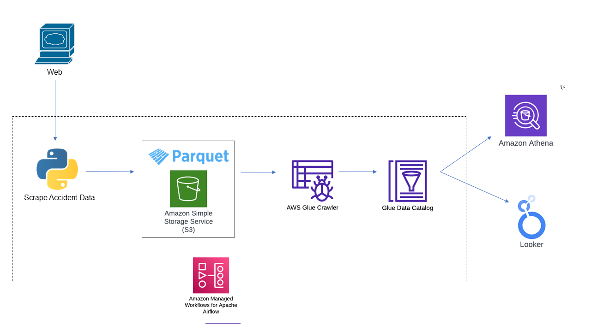
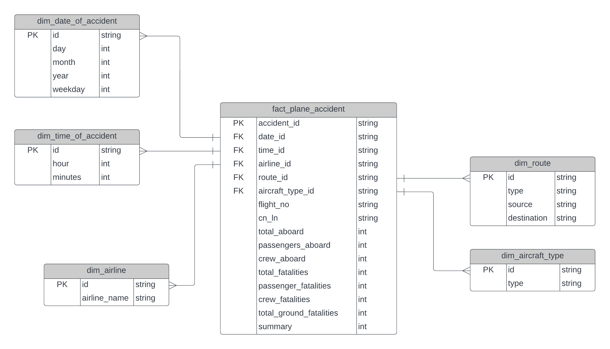

# Plane Crash Data Analysis

In this project, I'm going to scrap aviation accidents data from https://www.planecrashinfo.com/database.htm
from 1920 to 2023 and perform data analysis on top of it.

Here's the initial sketch of the data pipeline:

And here's the data model schema:

### Progress

05/11/2023 - Process raw JSON files into fact and dimension tables into separate parquet files.

Uploaded to S3: aws s3 cp . s3://plane-crash-datalake/raw --recursive

05/04/2023 - Raw data collected from 1920 to 2022